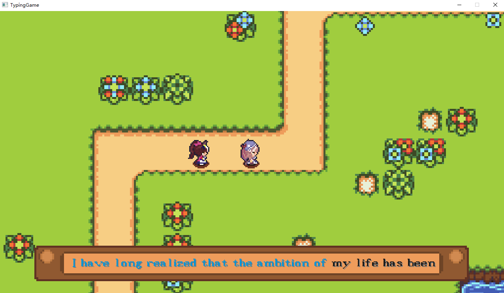

# TypingGame - 实时双人打字竞速游戏



## 项目概述
一款基于C++开发的使用EasyX图形库实现的实时双人打字竞速游戏，采用客户端-服务器架构。两名玩家通过输入指定文本内容竞速，角色将根据打字进度在赛道上移动，优先完成者获胜。

## 功能特性
- 🕹️ 双人实时对战模式
- 📡 基于HTTP协议的客户端与服务器通信
- 🖼️ 2D动画角色与场景渲染
- 🎮 实时进度同步与角色运动

## 核心文件结构
```text
TypingGame/
├── Server/                 # 服务器端
│   ├── server.cpp          # 主服务器逻辑
│   └── text.txt            # 比赛文本内容
│
├── Client/                 # 客户端
│   ├── src/                # 源代码
│   │   ├── client.cpp      # 主客户端逻辑
│   │   ├── animation.h     # 动画处理模块
|   |   ├── atlas.h			# 资源类
│   │   ├── camera.h        # 摄像机控制模块
│   │   ├── path.h          # 运动路径计算
│   │   ├── player.h        # 玩家角色控制
│	│	├── timer.h			# 定时器
│	│	├──	util.h			# 工具函数
│   │   ├──	vector2.h		# 封装的二维向量类
│   │   └──	config.cfg      # 服务器配置
│   └── resources/          # 游戏资源
│
└── thirdparty/             # 第三方依赖库
    └── httplib/            # HTTP服务器库
```
## 项目介绍

### 依赖项
- C++14
- EasyX图形库（Windows）
- httplib

### 配置文件
`config.cfg` 连接服务器的IP地址与端口：

```text
http://localhost:25565
```

## 核心模块说明

### 服务器架构 (server.cpp)
- **路由处理**：
  
  ```cpp
  POST /login         // 玩家登录
  POST /query_text    // 获取比赛文本
  POST /update_[1|2]  // 更新玩家进度
  ```
- **线程安全**：
  
  - httplib库使用多线程处理多个连接，故访问共享资源progress_1、progress_2时需使用全局互斥锁 (`std::mutex`) 保证线程安全，并使用`std::lock_guard`实现锁的自动获取与释放
  
- **状态同步**：

  - 通过在update相关progress时传递对方progress实现客户端状态同步，避免繁琐的序列化过程

### 客户端架构 (client.cpp)
#### 核心流程
1. 资源加载
2. 服务器连接
3. 游戏主循环
   - 处理玩家输入
   - 处理游戏更新
   - 处理画面绘制

#### 关键功能
- **双线程设计**：主线程负责处理用户输入和本地状态更新、绘图。后台线程负责与服务端通信，周期同步双方进度。使用原子变量`std::atomic`保证线程安全
- **动画系统**：通过Atlas类管理角色动画帧，Animation类渲染动画
- **路径系统**：Path类实现根据打字进度计算角色位置
- **摄像机系统**：通过Camera类实现玩家跟随视角
- **帧率稳定与平滑移动**：精确计算帧间隔保持144FPS，同时通过Timer类定时器逻辑避免出现帧数越快移动越快情况


### 数据格式
- 进度更新：玩家完成的字符数代表玩家进度

#### 客户端头文件说明

##### animation.h

Animation类管理动画序列的帧切换与渲染，实现角色动画的播放与显示

##### atlas.h

Atlas类管理动画帧序列的加载与存储

##### camera.h

Camera类通过设置尺寸和中心定位（`look_at`）方法，实现以目标点为中心的视口偏移计算，控制场景渲染范围

##### path.h

Path类封装预设运动路径的坐标插值计算，根据进度参数返回路径上的精确位置，用于角色沿固定轨迹的移动控制

##### player.h

Player类实现玩家角色的动画状态机与移动控制，根据移动方向切换奔跑/闲置动画，管理目标位置插值移动及朝向更新

##### timer.h

Timer类提供可配置的单次或循环定时器功能，用于管理游戏中的时间触发事件（如倒计时、动画更新等）

##### util.h

封装图像透明绘制与音频播放工具函数，包含摄像机偏移处理和 MCI 命令封装

##### vector2.h

Vector2 类重载一系列运算符，提供二维向量运算的核心功能，并提供normalize方法实现斜角匀速移动和approx方法实现对浮点数近似为0的判断
